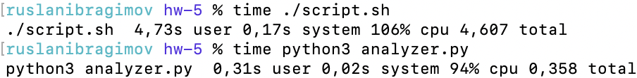
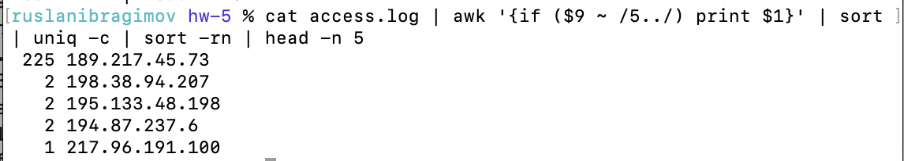
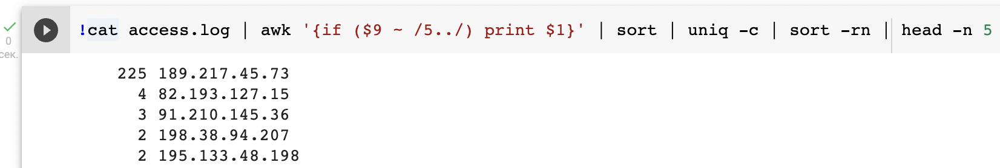

# Домашнее задание №5
## Python
Был составлен скрипт analyzer.py, который открывает файл "access.log" на чтение, построчно разбирает его
и формирует json-подобную структуру с результатом. Для уменьшения размера скрипта и разделения логики,
составлен вспомогательный скрипт utils.py, к которому обращается analyzer.py.

Если был передан флаг --json, то создает в текущей директории файл "res.json", куда записывает результат в формате json.

В ином случае, создает в текущей директории файл "res.txt", куда записывает результат в текстовом формате

**Необходимо запускать скрипт, находясь в директории с "access.log", иначе скрипт не найдет файл!!!**

### Плюсы написания скрипта на Python:
* Скорость работы

* Возможность использовать готовые библиотеки и фреймворки
* Относительная возможность не зависеть от платформы
* Легко достичь масштабируемости скрипта, если потребуется
* Интуитивно понятнее (субъективно)
* Можно найти больше информации в интернете
### Минусы:
* Приходится писать много кода по сравнению с bash
* Инструмент более широкого профиля, а значит, нет некоторых удобных плюшек, которые позволяют писать однострочники

## Bash
Был составлен скрипт script.sh, который читает файл "access.log", получает из него необходимую информацию и
записывает ее в файл "res.txt". По сути, если исключить цикл для красивого вывода, то благодаря pipelines
каждая команда занимает одну строку. 

**Необходимо запускать скрипт, находясь в директории с "access.log", иначе скрипт не найдет файл!!!**

### Плюсы написания скрипта на Bash:
* Возможность реализовать сложную логику в одну строку
* Наличие гениальных в своей простоте и удобстве решений, вроде перенаправления потоков

### Минусы:
* Необходимость изворачиваться, когда нужны средства языка программирования
* Сложно писать что-то хотя бы немного сложное и хорошо оптимизированное - придется либо использовать
вспомогательные скрипты на других языках программирования, либо жертвовать читабельностью и малым размером скрипта
* Напрочь отбитое желание делать это снова из-за кривого интерпретатора на macOS (субъективно, но для меня самое неприятное)

Результат выполнения команды у меня - почему-то при нескольких столбцах в строке неправильно работает сортировка через флаг -n

Результат выполнения той же команды в Google Colab

